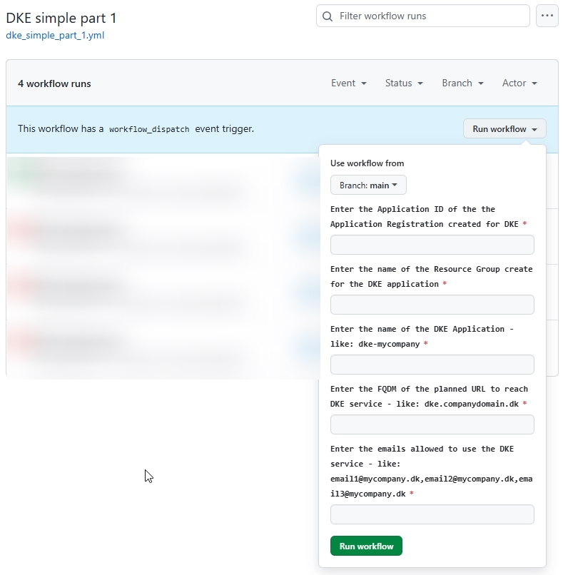

# Instructions on how to deploy DKE

The guide is intended for cases where a simple demonstration of [DKE](https://learn.microsoft.com/en-us/purview/double-key-encryption?view=o365-worldwide#supported-environments-for-storing-and-viewing-dke-protected-content) is required. Everything is running in Microsoft Azure, connected to local tenant.

## Suggested steps

1. [Fork repository](https://docs.github.com/en/pull-requests/collaborating-with-pull-requests/working-with-forks/fork-a-repo)
2. [Ensure permissions](#permissions)
3. [Add Azure services](#az_services)
4. [Execute DKE deployment](#workflow-part1)
5. [Update application permissions](#workflow-part1-finalize)

## Permissions required

1 Service Principal:

* Assigned [Contributor](https://learn.microsoft.com/en-us/azure/role-based-access-control/built-in-roles/privileged#contributor) to target Resource Group for DKE deployment - see instructions [here](iac\README.md)

1 User:

* Assigned [Application Developer](https://learn.microsoft.com/en-us/entra/identity/role-based-access-control/permissions-reference#application-developer) to create Application Registration in Entra ID
* [Contributor](https://learn.microsoft.com/en-us/azure/role-based-access-control/built-in-roles/privileged#contributor) at target Subscription for DKE deployment

## Naming convention

Use the convention according to your company requirements.

### Optional

This guide will suggest to use a name like: **dke-demo-contoso**, where contoso represents tenant name. dke-demo-contoso will be prefixed with app- during deployment, resulting in an Azure App Service named app-dke-demo-contoso. Other required services will be prefixed accordingly.

## Create Azure services

Here you will create required pre-deployed Azure services, using the [User]().

### Application Registration

#### 1. Create blank Application Registration

Following [this](https://learn.microsoft.com/en-us/entra/identity-platform/quickstart-register-app?tabs=certificate#register-an-application) guide you will create a blank application registration. This guide will describe additional steps on how to configure the application registration. Those steps will not be required and must be ignored, since you will update the application registrations configuration at a later point in this guide.

Save Application (Client) ID for later usage.

### Resource Group

#### 1. Create Resource Group

Create a new Resource Group.

Save Resource Group name for later usage.

## Deploy DKE service - part 1

### DNS record

As part of the DKE service a **CNAME** will be required to be registered. At this point, you must decide on a name that can be used - you will create the record in your DNS provider later, after deploy DKE service is finalized. This will also be the URL that is later used in the configuration of Sensitivity Labels.

The CNAME could be: **dke-demo.contoso.com** -> app-dke-demo-contoso.azurewebsites.net

Save the CNAME name for later usage.

### Execute workflow

Execute workflow named **DKE simple part 1** and fill in the following parameters. The required parameters will be asked for at execution time.

## Update Application Registration

## Deploy DKE service - part 2
